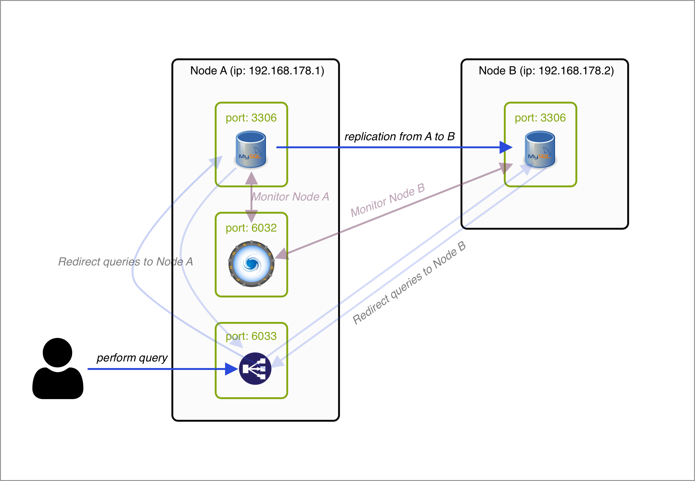

# ProxySQL

Issues with the setup of `1-setup-replication.md` are described below.

### 1. Writes on Slave Nodes
It is possible to perform writes on the slave nodes (node B), however, these changes will not be reflected on the master. To ensure the consistency of data, it is crucial that all writes are performed on the master, while reads can be performed on either node. To avoid confusion for clients, it might be beneficial to have an extra layer for better control.

### 2. Unequal Traffic Distribution
In case of a read query that could be executed on more than one slaves, different clients may connect to the same instance, causing an unequal distribution of traffic and resulting in performance issues. To address this, there is a need for a load balancing layer that can distribute the queries, for example in a round-robin fashion.

Another example, if there is a large amount of operational data that data analysts want to analyze, performing read queries on the master (node A) might not be feasible as it may slow down new writes and reads of production queries. To prevent this, it is necessary to have the capability to redirect specific queries or users to a specific group of instances.

### Proposed solution: ProxySQL
ProxySQL is a high-performance, open-source proxy for MySQL databases. It acts as a middleman between your application and your database, routing queries and managing connections to ensure optimal performance and security.

## Architecture

We have two nodes, A and B, where a MySQL master is running on node A and a MySQL slave on node B. In addition, there are two additional processes, which are located on node A but could also be on separate nodes:

1. `ProxySQL Admin`: This process is responsible for configuring ProxySQL and runs on port 6032. It communicates with the targeted MySQL instances.
2. `ProxySQL Client`: Client queries are routed to port 6033, where ProxySQL redirects traffic to one of the nodes based on a set of rules, such as read-write splitting or user-based routing.

## Installation
The replication must already be set up, as outlined in the document `1-setup-replication.md`. Next, the following steps should be performed.

### 1. Download ProxySQL
Retrieve ProxySQL package: \
`wget https://github.com/sysown/proxysql/releases/download/v2.0.4/proxysql_2.0.4-ubuntu16_amd64.deb`

Install package: \
`sudo dpkg -i proxysql_2.0.4-ubuntu16_amd64.deb`

Start ProxySQL: \
`sudo systemctl start proxysql`

### 2. Configure ProxySQL
Follow step 2 until step 8 [here](https://www.digitalocean.com/community/tutorials/how-to-use-proxysql-as-a-load-balancer-for-mysql-on-ubuntu-16-04) (TODO: elaborate on steps)

Some important notes:
- The initial password of the ProxySQLAdmin client is 'admin'
- When creating the monitor/playground user, use `native_password` instead of `caching_` (temporary solution)

## Useful commands

### Listen to traffic on port 3306
`tcpdump port 3306 and '(tcp-syn|tcp-ack)!=0'`

### See status of each host in ProxySQL
`SELECT hostname, from_unixtime(time_start_us/1000000) AS last_check, ping_error AS error from monitor.mysql_server_ping_log group by hostname order by time_start_us desc`

### Example of ProxySQL rules
With the following example, we redirect all traffic that starts with `SELECT COUNT` to the destination group `2`: 

`INSERT INTO mysql_query_rules (rule_id, active, match_digest, destination_hostgroup, apply) VALUES (1, 1, '^SELECT COUNT.*$', 3, 1);`

### Example query to perform on the ProxySQL Client
See which host is used for the MySQL query:

`mysql -u playgrounduser -pplaygroundpassword -h 127.0.0.1 -P 6033 --prompt='ProxySQLClient> ' -e 'SELECT @@hostname;'`

## Sources
- [Issue read-only](https://github.com/sysown/proxysql/issues/2074)
- [ProxySQL](https://proxysql.com/documentation/)
- [Installation ProxySQL](https://www.arubacloud.com/tutorial/how-to-optimize-mysql-queries-with-proxysql-caching-on-ubuntu-20-04.aspx)
- [Read-Write splitting](https://proxysql.com/documentation/proxysql-read-write-split-howto/)
    1. Set `read_only` in the reader node
