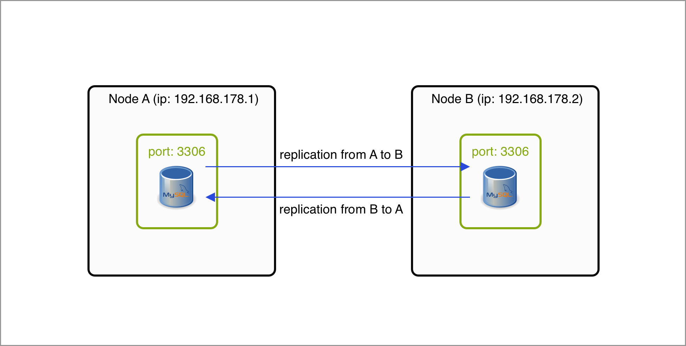
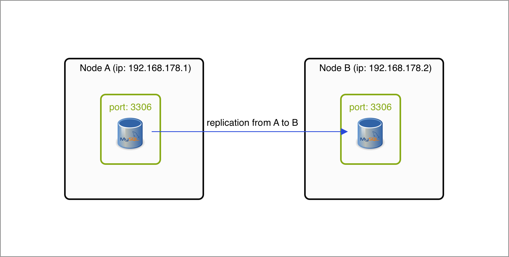

# Master-Master or Master-Slave replication

The aim of this repository is to show how simple database replication can be achieved in a MySQL (Ubuntu 20.04 server) environment.
By far, this setup cannot be used in production for several reasons (including when a node goes down). However, it still
gives you something to play around with and see the possibilities. 

In this documentation, two MySQL servers will be used where the follow a Master-Master setup. Of course, you can add more instances but then you have to add more replication rules yourself. Here, the following server IPs are used:
- A: 192.168.178.1
- B: 192.168.178.2

The architecture looks as following:


In case of Master-Slave replication (where A is the master and B the slave), steps 6, 8A and 9 should be omitted. The architecture then looks as following:


## 1) Install MySQL
Install MySQL on both servers \
```sudo apt-get install mysql-server```

## 2) Open SQL port
Open 3306 ports on both Ubuntu servers \
```ufw allow 3306/tcp```

## 3) Update MySQL config
Execute the following command on both servers: \
```nano /etc/mysql/mysql.conf.d/mysqld.cnf``` \
Paste the contents of master.conf here. Note: update the server-id as every MySQL instance should have an unique integer value. 

## 4) Restart MySQL
Restart MySQL to make the changes visible: \
```systemctl restart mysql```

## 5) Create replication user + grants on server A
Here, a user `rpl_user` is created which will be used used to authorize himself on Server B: 
```CREATE USER 'rpl_user'@'192.168.178.2' IDENTIFIED BY 'StrongPassw0rd';``` 

Next, we allow Server B to replicate all database and tables (hence `*.*`) by the user `rpl_user` (which we will create in the next step). In practice, you might probably do not wanna give the replication user all permissions. \
```GRANT REPLICATION SLAVE ON *.* TO rpl_user@192.168.178.2;``` \
```FLUSH PRIVILEGES;```

## 6) Create replication user + grants on server B
Here, a user `rpl_user` is created which will be used used to authorize himself on Server A: 
```CREATE USER 'rpl_user'@'192.168.178.1' IDENTIFIED BY 'StrongPassw0rd';``` 

Next, we allow Server A to replicate all database and tables (hence `*.*`) by the user `rpl_user` (which we will create in the next step): 

```GRANT REPLICATION SLAVE ON *.* TO rpl_user@192.168.178.1;``` \
```FLUSH PRIVILEGES;```

## 7) Authenticate slave
Step A: Authenticate in slave A for channel of B (master=2): \
```CHANGE MASTER TO GET_MASTER_PUBLIC_KEY=1 for channel 'master-2';```

Step B: Authenticate in slave B for channel of A (master=1): \
```CHANGE MASTER TO GET_MASTER_PUBLIC_KEY=1 for channel 'master-1';```

## 8) Start replication in server A
Read the \<mysql-bin> file and the \<file-pointer> in server B with the command: \
```show master status \G``` \
Next, update server A: \
```CHANGE MASTER TO MASTER_HOST='192.168.178.2', MASTER_USER='rpl_user', MASTER_PASSWORD='StrongPassw0rd', MASTER_LOG_FILE='<mysql-bin>', MASTER_LOG_POS=<file-pointer> for channel 'master-2';``` \
Start slave:
```start slave for channel 'master-2';``` 

## 9) Start replication in server B
Read the \<mysql-bin> file and the \<file-pointer> in server A with the command: \
```show master status \G``` \
Next, update server B: \
```CHANGE MASTER TO MASTER_HOST='192.168.178.1', MASTER_USER='rpl_user', MASTER_PASSWORD='StrongPassw0rd', MASTER_LOG_FILE='<mysql-bin>', MASTER_LOG_POS=<file-pointer> for channel 'master-1';``` \
Start slave: \
```start slave for channel 'master-1';``` 

## 10) Should be working now :)

-------
sources: 
- https://www.ryadel.com/en/mysql-master-master-replication-setup-in-5-easy-steps/
- https://computingforgeeks.com/configure-mysql-8-master-slave-replication-on-ubuntu/

There are more interesting topics to explore! Here are some directions:
1. Multi-source replication (https://www.percona.com/blog/2013/10/02/mysql-5-7-multi-source-replication/)
2. Semi-sync:
    - http://mysql.wingtiplabs.com/documentation/sem40sk7/establish-semi-synchronous-replication.html
    - explanation: https://dev.mysql.com/doc/refman/5.7/en/replication-semisync.html